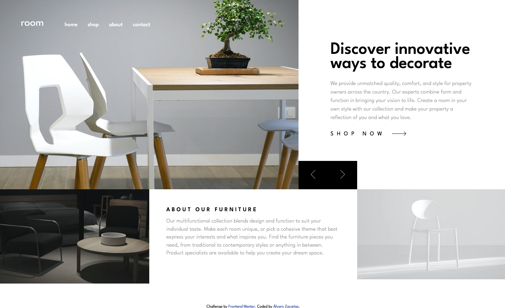
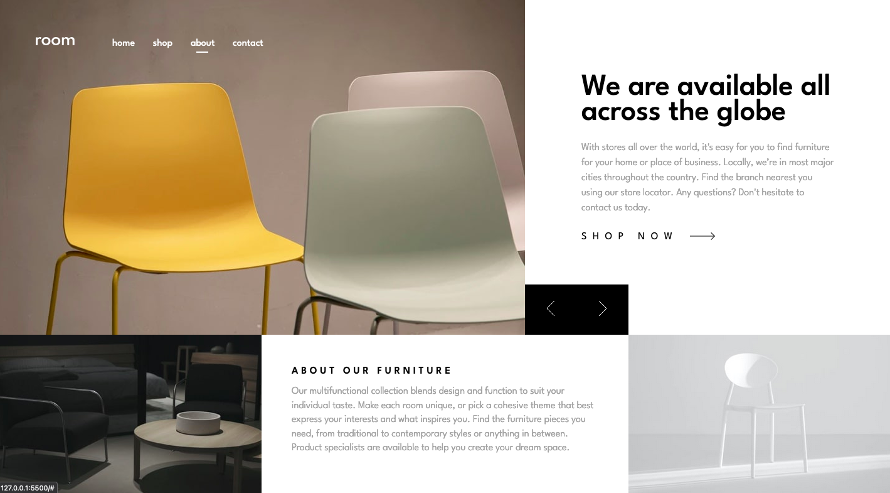
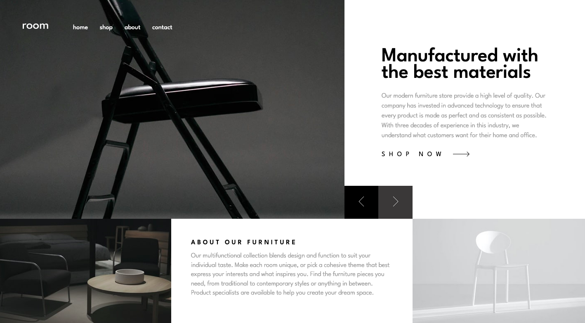
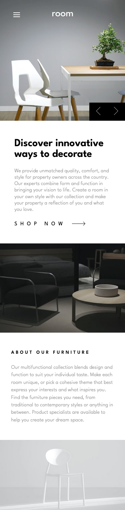
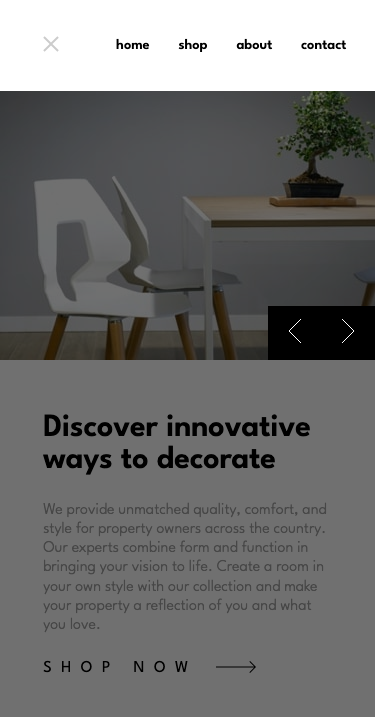

# Frontend Mentor - Room homepage solution

This is a solution to the [Room homepage challenge on Frontend Mentor](https://www.frontendmentor.io/challenges/room-homepage-BtdBY_ENq). Frontend Mentor challenges help you improve your coding skills by building realistic projects. 

## Table of contents

- [Overview](#overview)
  - [The challenge](#the-challenge)
  - [Screenshot](#screenshot)
  - [Links](#links)
- [My process](#my-process)
  - [Built with](#built-with)
  - [What I learned](#what-i-learned)
  - [Continued development](#continued-development)
- [Author](#author)

## Overview

### The challenge

Users should be able to:

- View the optimal layout for the site depending on their device's screen size
- See hover states for all interactive elements on the page
- Navigate the slider using either their mouse/trackpad or keyboard

### Screenshot

### Links

- Solution URL: [https://github.com/alvarozama/Room-homepage]
- Live Site URL: [https://alvarozama.github.io/Room-homepage/]

## My process

### Built with

- Semantic HTML5 markup
- CSS custom properties
- Flexbox
- CSS Grid
- Mobile-first workflow
- SCSS 

### What I learned

Not much this time around. On the contrary, I feel like I was not creative enough to come up with a cool animation/transition for changing slides.

### Continued development

I would like to explore ways to implement cooler visual effects for switching slides. I would also like to figure out ways to make the site more responsive, especiallywith my absolutely positiones buttons.

## Author

- Frontend Mentor - [@alvarozama](https://www.frontendmentor.io/profile/alvarozama)

